# Alex StackKens

**Full-Stack JavaScript Developer**

Building scalable web and mobile applications with modern JavaScript technologies.

  

## About Me

I'm a full-stack JavaScript developer and an aspiring AI/ML engineer who enjoys turning ideas into complete, working software — from interfaces users interact with, to the APIs and databases running underneath.

My focus is clean architecture, maintainable code, and building systems that hold up as requirements grow. I care as much about *why* something works as I do about shipping it.

**What I value in software:**

* Simple, maintainable code over clever shortcuts
* Designed around the user, not just the feature list
* Built to scale, secure by default
* Continuously refined, never "done and forgotten"

**Currently exploring:** scalable application architecture · backend engineering · database design · authentication systems · mobile development · system design

## Tech Stack

<table>
<tr>
<th align="left">Layer</th>
<th align="left">Technologies</th>
<th align="left">Focus</th>
</tr>

<tr>
<td valign="middle"><b>Languages</b></td>
<td valign="middle">

 JavaScript · TypeScript · Python · SQL
</td>
<td valign="middle">Application logic · scripting · queries</td>
</tr>

<tr>
<td valign="middle"><b>Frontend & Mobile</b></td>
<td valign="middle">

 React · React Native · Expo · Vite · Tailwind CSS · Figma
</td>
<td valign="middle">Web & mobile UI · design systems</td>
</tr>

<tr>
<td valign="middle"><b>Backend</b></td>
<td valign="middle">

 Node.js · Express · REST APIs · JWT
</td>
<td valign="middle">API design · authentication · business logic</td>
</tr>

<tr>
<td valign="middle"><b>Database</b></td>
<td valign="middle">

 PostgreSQL · Prisma · Firebase · SQLite
</td>
<td valign="middle">Schema design · persistence · data modeling</td>
</tr>

<tr>
<td valign="middle"><b>State & Data</b></td>
<td valign="middle">

 Zustand · TanStack Query · Axios · React Router
</td>
<td valign="middle">Client & server state · data fetching</td>
</tr>

<tr>
<td valign="middle"><b>Tools</b></td>
<td valign="middle">

 Git · GitHub · Linux · VS Code · Postman · Sentry
</td>
<td valign="middle">Development · debugging · monitoring</td>
</tr>

<tr>
<td valign="middle"><b>AI-Assisted Dev</b></td>
<td valign="middle">

 Claude · OpenAI
</td>
<td valign="middle">Pair-programming · code review · ML exploration</td>
</tr>

</table>

 

### Data Flow

## Featured Projects

### ⛪ DCN Mobile

**A production-ready Church Management Platform built with React Native, Node.js, Express, PostgreSQL, Prisma, and TypeScript.**

DCN Mobile is designed as a scalable digital platform for church communities, bringing together member management, sermons, events, giving, live streaming, and AI-powered capabilities within a unified application ecosystem.

**Key features:** member management · sermons · events · giving · live streaming · church administration · AI integrations · scalable backend architecture

**Built with:**

 

### 💳 PrimeBooks POS

Mobile Point of Sale app for managing products, sales, and daily operations — built offline-first for reliability in the field.

**Key features:** inventory management · sales tracking · offline-first data handling · Bluetooth receipt printing · analytics dashboards · secure local storage

**Built with:**

 

### 💰 SACCOConnect

Mobile application for Savings and Credit Cooperative Organizations (SACCOs), giving members finance tools and admins full loan-workflow control.

**Key features:** member accounts · savings management · loan applications & approval workflow · repayment tracking · financial monitoring

**Built with:**

 

### 🎓 Study Circle

Collaborative learning platform for university students to connect, share resources, and study together.

**Key features:** student collaboration · discussion threads · resource sharing · instructor tools

**Built with:**

 

 

### ✍️ StateCraft Blog `— in development`

Full-stack blogging platform built to explore modern application architecture and scalable development practices, with a focus on production-ready backend design.

**Main focus:** Context API state management · JWT authentication & refresh token rotation · PostgreSQL schema design · production-ready folder structure

**Built with:**

## Currently Learning

Advanced PostgreSQL · Backend architecture · System design · Authentication & security · Performance optimization · Cloud deployment · Python · AI/ML

## GitHub Analytics

 

**Let's connect** — [LinkedIn](https://www.linkedin.com/in/alex-stackkens-4937113a8) · [X](https://x.com/stackkens) · [Reddit](https://reddit.com/u/stackkens)

*Building software one commit at a time.*

